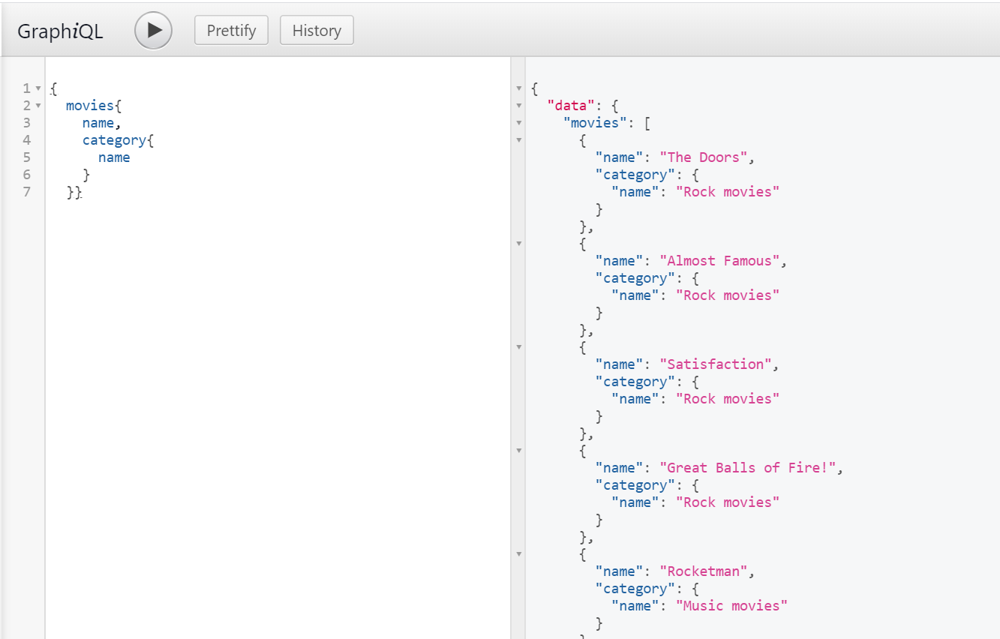

# cinema-api

Example application with Spring Boot, GraphQL and Docker

### Tools

- Java SE Development Kit (min 8.0)
- Spring Tools IDE
- Maven
- GraphQL
- Docker
- Postgres
- Git

## Built with:

- [Spring Boot](https://spring.io/projects/spring-boot)
- [Maven](https://maven.apache.org/)

## Run

```sh
$ mvn clean install-DskipTests=true
$ docker-compose up
$ docker ps
```

GraphQL is a query language for your API, and a server-side runtime for executing queries by using a type system you define for your data.
GraphQL isn't tied to any specific database or storage engine and is instead backed by your existing code and data

http://localhost:8080/graphiql




